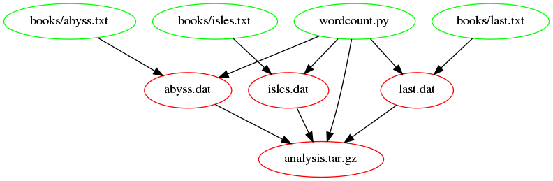

> ## Learning Objectives {.objectives}
>
> * Output files are a product not only of input files but of the
>   scripts or code that created the output files. 
> * Recognise and avoid false dependencies.

Our Makefile now looks like this:

~~~ {.make}
# Generate summary table.
results.txt : *.dat
        python zipf_test.py $^ > $@

# Count words.
.PHONY : dats
dats : isles.dat abyss.dat last.dat

isles.dat : books/isles.txt
        python wordcount.py $< $@

abyss.dat : books/abyss.txt
        python wordcount.py $< $@

last.dat : books/last.txt
        python wordcount.py $< $@

.PHONY : clean
clean :
        rm -f *.dat
        rm -f results.txt
~~~

Our data files are a product not only of our text files but the
script, `wordcount.py`, that processes the text files and creates the
data files. A change to `wordcount.py` (e.g. to add a new column of summary data or remove an existing one) results in changes to the `.dat` files it outputs. So, let's pretend to edit `wordcount.py`, using `touch`, and re-run Make:

~~~ {.bash}
$ make dats
$ touch wordcount.py
$ make dats
~~~

Nothing happens! Though we've updated `wordcount.py` our data files are not updated because our rules for creating `.dat` files don't record any dependencies on `wordcount.py`.

We need to add `wordcount.py` as a dependency of each of our
data files also:

~~~ {.make}
isles.dat : books/isles.txt wordcount.py
        python wordcount.py $< $@

abyss.dat : books/abyss.txt wordcount.py
        python wordcount.py $< $@

last.dat : books/last.txt wordcount.py
        python wordcount.py $< $@
~~~

If we pretend to edit `wordcount.py` and re-run Make,

~~~ {.bash}
$ touch wordcount.py
$ make dats
~~~

then we get:

~~~ {.output}
python wordcount.py books/isles.txt isles.dat
python wordcount.py books/abyss.txt abyss.dat
python wordcount.py books/last.txt last.dat
~~~

The following figure shows the dependencies embodied within our Makefile, involved in building the `results.txt` target, after adding `wordcount.py` as a dependency to the `.dat` files:

> ## Why don't the `.txt` files depend on `wordcount.py`? {.callout}
>
> `.txt` files are input files and have no dependencies. To make these
> depend on `wordcount.py` would introduce a [false
> dependency](reference.html#false-dependency).

Intuitively, we should also add `wordcount.py` as dependency for `results.txt`, as the final table should be rebuilt as we remake the `.dat` files. However, it turns out we don't have to! Let's see what happens to `results.txt` when we update `wordcount.py`:

~~~ {.bash}
$ touch wordcount.py
$ make results.txt
~~~

then we get:

~~~ {.output}
python wordcount.py books/abyss.txt abyss.dat
python wordcount.py books/isles.txt isles.dat
python wordcount.py books/last.txt last.dat
python zipf_test.py abyss.dat isles.dat last.dat > results.txt
~~~

The whole pipeline is triggered, even the creation of the `results.txt` file! To understand this, note that according to the dependency figure, `results.txt` depends on the `.dat` files. The update of `wordcount.py` triggers an update of the `*.dat` files. Thus, `make` sees that the dependencies (the `.dat` files) are newer than the target file (`results.txt`) and thus it recreates `results.txt`. This is an example of the power of `make`: updating a subset of the files in the pipeline triggers rerunning the appropriate downstream steps.

> ## Updating one input file {.challenge}
>
> What will happen if you now execute:
>
> ~~~ {.bash}
> $ touch books/last.txt
> $ make results.txt
> ~~~
>
> 1. only `last.dat` is recreated
> 2. all `.dat` files are recreated
> 3. only `last.dat` and `results.txt` are recreated
> 4. all `.dat` and `results.txt` are recreated

> ## `wordcount` as dependency of `results.txt` {.challenge}
>
> What would happen if you actually added `wordcount.py` as dependency of `results.txt`, and why?

We still have to add the `zipf-test.py` script as dependency to `results.txt`. Given the answer to the challenge above, we cannot use `$^` for the rule. We'll go back to using `*.dat`:

~~~ {.make}
results.txt : *.dat zip_test.py
        python zipf_test.py *.dat > $@
~~~
