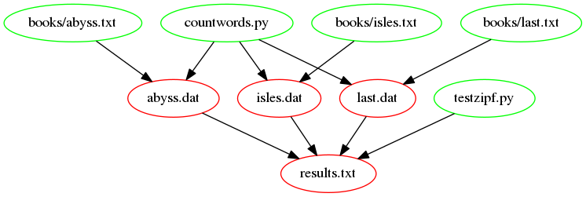

::::::::::::::::::::::::::::::::::::::: objectives

- Output files are a product not only of input files but of the scripts or code that created the output files.
- Recognize and avoid false dependencies.

::::::::::::::::::::::::::::::::::::::::::::::::::

:::::::::::::::::::::::::::::::::::::::: questions

- How can I write a Makefile to update things when my scripts have changed rather than my input files?

::::::::::::::::::::::::::::::::::::::::::::::::::

Our Makefile now looks like this:

```make
# Generate summary table.
results.txt : isles.dat abyss.dat last.dat
	python testzipf.py $^ > $@

# Count words.
.PHONY : dats
dats : isles.dat abyss.dat last.dat

isles.dat : books/isles.txt
	python countwords.py $< $@

abyss.dat : books/abyss.txt
	python countwords.py $< $@

last.dat : books/last.txt
	python countwords.py $< $@

.PHONY : clean
clean :
	rm -f *.dat
	rm -f results.txt
```

Our data files are produced using not only the input text files but also the
script `countwords.py` that processes the text files and creates the
data files. A change to `countwords.py` (e.g. adding a new column of
summary data or removing an existing one) results in changes to the
`.dat` files it outputs. So, let's pretend to edit `countwords.py`,
using `touch`, and re-run Make:

```bash
$ make dats
$ touch countwords.py
$ make dats
```

Nothing happens! Though we've updated `countwords.py` our data files
are not updated because our rules for creating `.dat` files don't
record any dependencies on `countwords.py`.

We need to add `countwords.py` as a dependency of each of our
data files also:

```make
isles.dat : books/isles.txt countwords.py
	python countwords.py $< $@

abyss.dat : books/abyss.txt countwords.py
	python countwords.py $< $@

last.dat : books/last.txt countwords.py
	python countwords.py $< $@
```

If we pretend to edit `countwords.py` and re-run Make,

```bash
$ touch countwords.py
$ make dats
```

then we get:

```output
python countwords.py books/isles.txt isles.dat
python countwords.py books/abyss.txt abyss.dat
python countwords.py books/last.txt last.dat
```

:::::::::::::::::::::::::::::::::::::::::  callout

## Dry run

`make` can show the commands it will execute without actually running them if we pass the `-n` flag:

```bash
$ touch countwords.py
$ make -n dats
```

This gives the same output to the screen as without the `-n` flag, but the commands are not actually run. Using this 'dry-run' mode is a good way to check that you have set up your Makefile properly before actually running the commands in it.

::::::::::::::::::::::::::::::::::::::::::::::::::

The following figure shows a graph of the dependencies, that are
involved in building the target `results.txt`. Notice the recently
added dependencies `countwords.py` and `testzipf.py`.  This is how the
Makefile should look after completing the rest of the exercises
in this episode.

{alt='results.txt dependencies after adding countwords.py and testzipf.py as dependencies'}

:::::::::::::::::::::::::::::::::::::::::  callout

## Why Don't the `.txt` Files Depend on `countwords.py`?

`.txt` files are input files and as such have no dependencies. To make these
depend on `countwords.py` would introduce a [false
dependency](../learners/reference.md#false-dependency) which is not desirable.


::::::::::::::::::::::::::::::::::::::::::::::::::

Intuitively, we should also add `countwords.py` as a dependency for
`results.txt`, because the final table should be rebuilt if we remake the
`.dat` files. However, it turns out we don't have to do that! Let's see what
happens to `results.txt` when we update `countwords.py`:

```bash
$ touch countwords.py
$ make results.txt
```

then we get:

```output
python countwords.py books/abyss.txt abyss.dat
python countwords.py books/isles.txt isles.dat
python countwords.py books/last.txt last.dat
python testzipf.py abyss.dat isles.dat last.dat > results.txt
```

The whole pipeline is triggered, even the creation of the
`results.txt` file! To understand this, note that according to the
dependency figure, `results.txt` depends on the `.dat` files. The
update of `countwords.py` triggers an update of the `*.dat`
files. Thus, `make` sees that the dependencies (the `.dat` files) are
newer than the target file (`results.txt`) and thus it recreates
`results.txt`. This is an example of the power of `make`: updating a
subset of the files in the pipeline triggers rerunning the appropriate
downstream steps.

:::::::::::::::::::::::::::::::::::::::  challenge

## Updating One Input File

What will happen if you now execute:

```bash
$ touch books/last.txt
$ make results.txt
```

1. only `last.dat` is recreated
2. all `.dat` files are recreated
3. only `last.dat` and `results.txt` are recreated
4. all `.dat` and `results.txt` are recreated

:::::::::::::::  solution

## Solution

`3.` only `last.dat` and `results.txt` are recreated.

Follow the dependency tree to understand the answer(s).


:::::::::::::::::::::::::

::::::::::::::::::::::::::::::::::::::::::::::::::

:::::::::::::::::::::::::::::::::::::::  challenge

## `testzipf.py` as a Dependency of `results.txt`.

What would happen if you added `testzipf.py` as dependency of `results.txt`, and why?

:::::::::::::::  solution

## Solution

If you change the rule for the `results.txt` file like this:

```make
results.txt : isles.dat abyss.dat last.dat testzipf.py
        python testzipf.py $^ > $@
```

`testzipf.py` becomes a part of `$^`, thus the command becomes

```bash
python testzipf.py abyss.dat isles.dat last.dat testzipf.py > results.txt
```

This results in an error from `testzipf.py` as it tries to parse the
script as if it were a `.dat` file. Try this by running:

```bash
$ make results.txt
```

You'll get

```error
python testzipf.py abyss.dat isles.dat last.dat testzipf.py > results.txt
Traceback (most recent call last):
  File "testzipf.py", line 19, in <module>
    counts = load_word_counts(input_file)
  File "path/to/testzipf.py", line 39, in load_word_counts
    counts.append((fields[0], int(fields[1]), float(fields[2])))
IndexError: list index out of range
make: *** [results.txt] Error 1
```

:::::::::::::::::::::::::

::::::::::::::::::::::::::::::::::::::::::::::::::

We still have to add the `testzipf.py` script as dependency to
`results.txt`.
Given the answer to the challenge above,
we need to make a couple of small changes so that we can still use automatic variables.

We'll move `testzipf.py` to be the first dependency and then edit the action
so that we pass all the dependencies as arguments to python using `$^`.

```make
results.txt : testzipf.py isles.dat abyss.dat last.dat
	python $^ > $@
```

:::::::::::::::::::::::::::::::::::::::::  callout

## Where We Are

[This Makefile](files/code/04-dependencies/Makefile)
contains everything done so far in this topic.


::::::::::::::::::::::::::::::::::::::::::::::::::

:::::::::::::::::::::::::::::::::::::::: keypoints

- Make results depend on processing scripts as well as data files.
- Dependencies are transitive: if A depends on B and B depends on C, a change to C will indirectly trigger an update to A.

::::::::::::::::::::::::::::::::::::::::::::::::::


