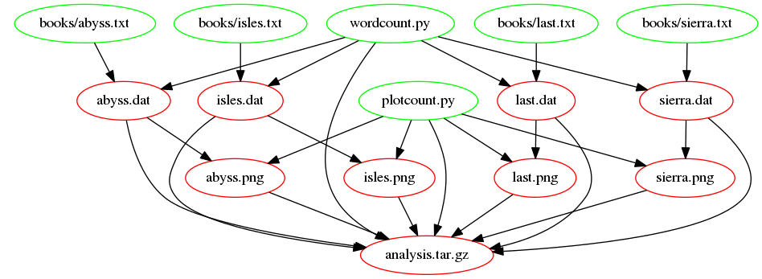

> ## Learning Objectives {.objectives}
>
> * Advantages of automated build tools such as Make.

Automated build tools such as Make can help us in a number of
ways. They help us to automate repetitive commands and, so, save us
time and reduce the risk of us making errors we might make if running
these commands manually.

They can also save time by ensuring that automatically-generated
artefacts (such as data files or plots) are only recreated when the
files that were used to create these have changed in some way.

Through their notion of targets, dependencies and actions they serve
as a form of documentation, recording dependencies between code,
scripts, tools, configurations, raw data, derived data, plots and
papers.

> ## Extend the Makefile to create PNGs {.challenge}
>
> Add new rules, update existing rules, and add new macros to:
> 
> * Create `.png` files from `.dat` files using `plotcount.py`.
> * Add the script and `.png` files to the archive.
> * Remove all auto-generated files (`.dat`, `.png`,
>   `analysis.tar.gz`). 
>
> Finally, many Makefiles define a default [phony target](reference.html#phony-target) called `all` that will build what the Makefile has been written to build (e.g. in our case, `analysis.tar.gz`). As others may assume your Makefile confirms to convention and supports an `all` target, add an `all` target to your Makefile (Hint: this rule has a single dependency but no actions).

The following figure shows the dependencies involved in building the `analysis.tar.gz` target, once we've added support for images:

