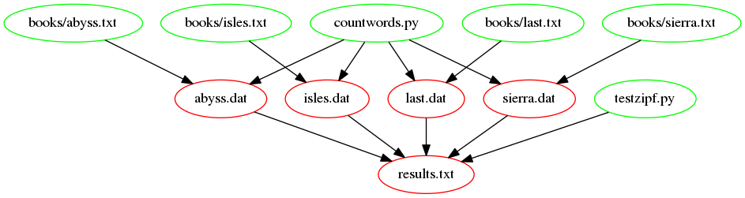

At this point, we have the following Makefile:

~~~
include config.mk

# Generate summary table.
results.txt : $(ZIPF_SRC) isles.dat abyss.dat last.dat
	$(ZIPF_EXE) *.dat > $@

# Count words.
.PHONY : dats
dats : isles.dat abyss.dat last.dat

%.dat : books/%.txt $(COUNT_SRC)
	$(COUNT_EXE) $< $*.dat

.PHONY : clean
clean :
	rm -f *.dat
	rm -f results.txt
~~~
{: .language-make}

Make has many [functions]({{ page.root }}/reference#function) which can be used
to write more complex rules. One example is `wildcard`. `wildcard` gets a
list of files matching some pattern, which we can then save in a
variable. So, for example, we can get a list of all our text files
(files ending in `.txt`) and save these in a variable by adding this at
the beginning of our makefile:

~~~
TXT_FILES=$(wildcard books/*.txt)
~~~
{: .language-make}

We can add a `.PHONY` target and rule to show the variable's value:

~~~
.PHONY : variables
variables:
	@echo TXT_FILES: $(TXT_FILES)
~~~
{: .language-make}

> ## @echo
>
> Make prints actions as it executes them. Using `@` at the start of
> an action tells Make not to print this action. So, by using `@echo`
> instead of `echo`, we can see the result of `echo` (the variable's
> value being printed) but not the `echo` command itself.
{: .callout}

If we run Make:

~~~
$ make variables
~~~
{: .language-bash}

We get:

~~~
TXT_FILES: books/abyss.txt books/isles.txt books/last.txt books/sierra.txt
~~~
{: .output}

Note how `sierra.txt` is now included too.

`patsubst` ('pattern substitution') takes a pattern, a replacement string and a
list of names in that order; each name in the list that matches the pattern is
replaced by the replacement string. Again, we can save the result in a
variable. So, for example, we can rewrite our list of text files into
a list of data files (files ending in `.dat`) and save these in a
variable:

~~~
DAT_FILES=$(patsubst books/%.txt, %.dat, $(TXT_FILES))
~~~
{: .language-make}

We can extend `variables` to show the value of `DAT_FILES` too:

~~~
.PHONY : variables
variables:
	@echo TXT_FILES: $(TXT_FILES)
	@echo DAT_FILES: $(DAT_FILES)
~~~
{: .language-make}

If we run Make,

~~~
$ make variables
~~~
{: .language-bash}

then we get:

~~~
TXT_FILES: books/abyss.txt books/isles.txt books/last.txt books/sierra.txt
DAT_FILES: abyss.dat isles.dat last.dat sierra.dat
~~~
{: .output}

Now, `sierra.txt` is processed too.

With these we can rewrite `clean` and `dats`:

~~~
.PHONY : dats
dats : $(DAT_FILES)

.PHONY : clean
clean :
	rm -f $(DAT_FILES)
	rm -f results.txt
~~~
{: .language-make}

Let's also tidy up the `%.dat` rule by using the automatic variable `$@` instead
of `$*.dat`:

```
%.dat : books/%.txt $(COUNT_SRC)
	$(COUNT_EXE) $< $@
```
{: .language-make}

Let's check:

~~~
$ make clean
$ make dats
~~~
{: .language-bash}

We get:

~~~
python countwords.py books/abyss.txt abyss.dat
python countwords.py books/isles.txt isles.dat
python countwords.py books/last.txt last.dat
python countwords.py books/sierra.txt sierra.dat
~~~
{: .output}

We can also rewrite `results.txt`:

~~~
results.txt : $(ZIPF_SRC) $(DAT_FILES)
	$(ZIPF_EXE) $(DAT_FILES) > $@
~~~
{: .language-make}

If we re-run Make:

~~~
$ make clean
$ make results.txt
~~~
{: .language-bash}

We get:

~~~
python countwords.py books/abyss.txt abyss.dat
python countwords.py books/isles.txt isles.dat
python countwords.py books/last.txt last.dat
python countwords.py books/sierra.txt sierra.dat
python testzipf.py  last.dat  isles.dat  abyss.dat  sierra.dat > results.txt
~~~
{: .output}

Let's check the `results.txt` file:

~~~
$ cat results.txt
~~~
{: .language-bash}

~~~
Book	First	Second	Ratio
abyss	4044	2807	1.44
isles	3822	2460	1.55
last	12244	5566	2.20
sierra	4242	2469	1.72
~~~
{: .output}

So the range of the ratios of occurrences of the two most frequent
words in our books is indeed around 2, as predicted by Zipf's Law,
i.e., the most frequently-occurring word occurs approximately twice as
often as the second most frequent word.  Here is our final Makefile:

~~~
include config.mk

TXT_FILES=$(wildcard books/*.txt)
DAT_FILES=$(patsubst books/%.txt, %.dat, $(TXT_FILES))

# Generate summary table.
results.txt : $(ZIPF_SRC) $(DAT_FILES)
	$(ZIPF_EXE) $(DAT_FILES) > $@

# Count words.
.PHONY : dats
dats : $(DAT_FILES)

%.dat : books/%.txt $(COUNT_SRC)
	$(COUNT_EXE) $< $@

.PHONY : clean
clean :
	rm -f $(DAT_FILES)
	rm -f results.txt

.PHONY : variables
variables:
	@echo TXT_FILES: $(TXT_FILES)
	@echo DAT_FILES: $(DAT_FILES)
~~~
{: .language-make}

Remember, the `config.mk` file contains:

~~~
# Count words script.
LANGUAGE=python
COUNT_SRC=countwords.py
COUNT_EXE=$(LANGUAGE) $(COUNT_SRC)

# Test Zipf's rule
ZIPF_SRC=testzipf.py
ZIPF_EXE=$(LANGUAGE) $(ZIPF_SRC)
~~~
{: .language-make}

The following figure shows the dependencies embodied within our Makefile,
involved in building the `results.txt` target,
now we have introduced our function:



> ## Where We Are
>
> [This Makefile]({{ page.root }}/code/07-functions/Makefile)
> and [its accompanying `config.mk`]({{ page.root }}/code/07-functions/config.mk)
> contain all of our work so far.
{: .callout}

> ## Adding more books
>
> We can now do a better job at testing Zipf's rule by adding more books.
> The books we have used come from the [Project Gutenberg](http://www.gutenberg.org/) website.
> Project Gutenberg offers thousands of free ebooks to download.
>
>  **Exercise instructions:**
>
> * go to [Project Gutenberg](http://www.gutenberg.org/) and use the search box to find another book,
> for example ['The Picture of Dorian Gray'](https://www.gutenberg.org/ebooks/174) from Oscar Wilde.
> * download the 'Plain Text UTF-8' version and save it to the `books` folder;
> choose a short name for the file (**that doesn't include spaces**) e.g. "dorian_gray.txt"
> because the filename is going to be used in the `results.txt` file
> * optionally, open the file in a text editor and remove extraneous text at the beginning and end
> (look for the phrase `End of Project Gutenberg's [title], by [author]`)
> * run `make` and check that the correct commands are run, given the dependency tree
> * check the results.txt file to see how this book compares to the others
{: .challenge}
